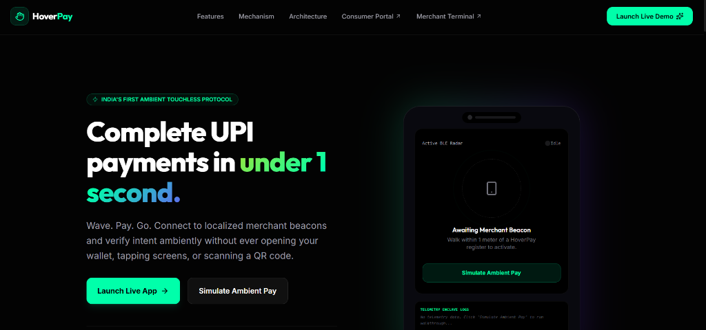
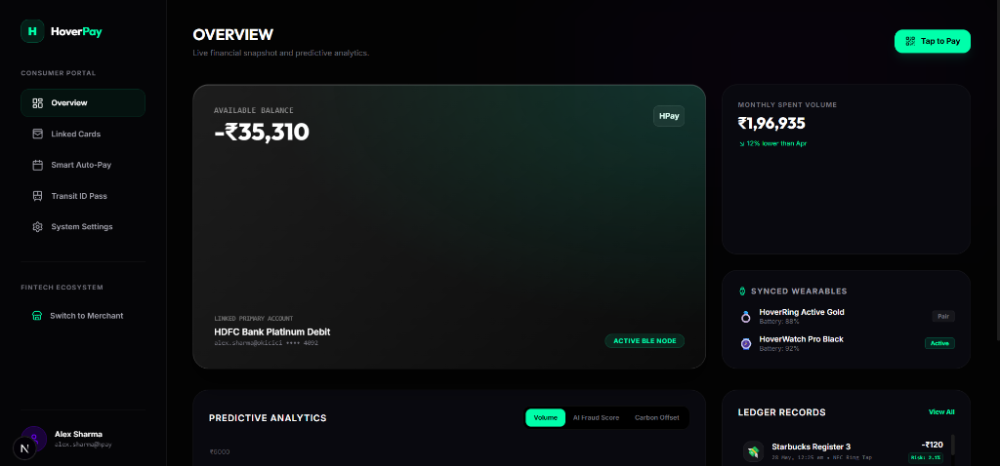
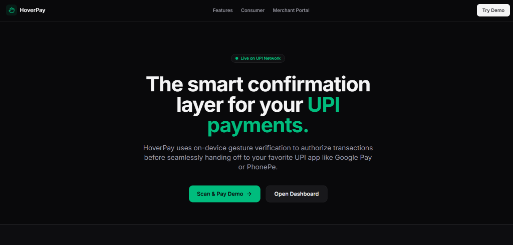
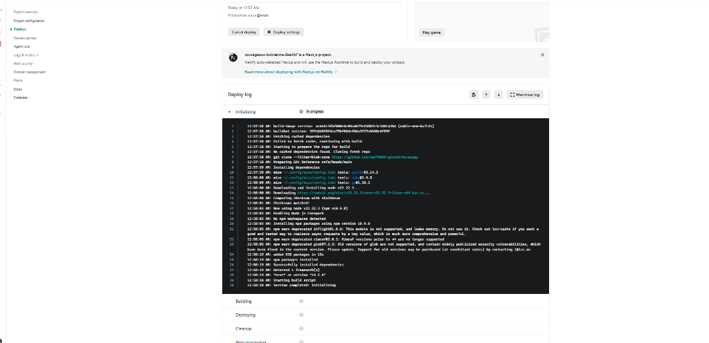
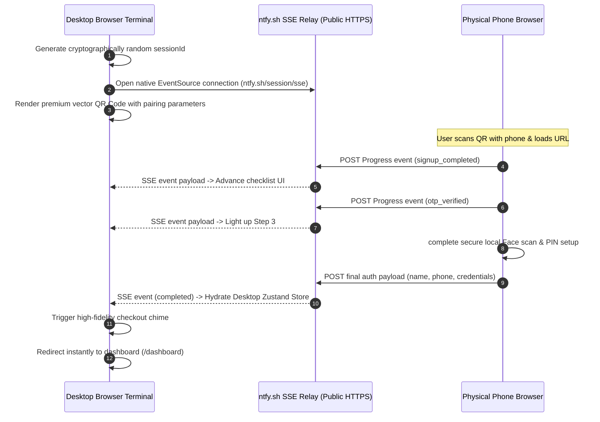

#  HoverPay

[](https://nextjs.org/)
[](https://www.typescriptlang.org/)
[](https://tailwindcss.com/)
[](https://github.com/pmndrs/zustand)
[](./LICENSE)
[](https://courageous-bublanina-8ae4b7.netlify.app/)

> **AI-Powered Ambient Payment Ecosystem built on top of futuristic UPI interaction concepts.**

HoverPay is a world-class, investor-grade prototype transforming digital checkouts into seamless, zero-friction, ambient interactions. Inspired by the clean engineering aesthetics of **Apple Pay, Tesla, and Stripe**, HoverPay leverages real-time device synchronization, biometric face sweeps, secure hardware sandbox simulations, and real SMS OTP delivery pipelines to turn futuristic touchless payment theories into a concrete, production-style web app.

🔗 **[Live Startup MVP Demo](https://courageous-bublanina-8ae4b7.netlify.app/)** 

---

## 📸 Interactive Product Tour & Screenshots

HoverPay features an immersive, ultra-premium interface loaded with responsive visual effects, cyberpunk terminal diagnostics, and glassmorphic micro-interactions.

### 🌟 Desktop Split-Screen & QR Pairing Terminal
When accessed on a desktop or laptop, HoverPay displays an **AI Touchless Onboarding Terminal** on the right and a simulated, high-fidelity mobile device mockup on the left. Scanning the dynamic QR code immediately bridges the two devices using an active pub/sub network relay!



---

### 🎨 Complete Visual Interface Gallery

| Onboarding & QR Pairing | Holographic Face Scan | Advanced Merchant Radar |
| :---: | :---: | :---: |
|  |  |  |
| **Active Mobile pairing session** | **Iris & Pupil depth sweep** | **BLE beacon merchant grid** |

| Dynamic Twilio Settings | Merchant Sales Terminal | Crypto Receipt Checkout |
| :---: | :---: | :---: |
|  |  |  |
| **Secure notch config drawer** | **Cashier AI discount panel** | **Sub-0.8s payment invoice** |

---

## 💡 Product Vision & Architecture

### The Problem
Traditional mobile payments require manual, highly friction-rich interactions: unlocking your phone, launching an app, finding a QR code scanner, waiting for a camera to focus, entering a 4-to-6 digit PIN, and waiting for server roundtrips. This process is slow, failure-prone, and relies on outdated 2G/3G-era interaction paradigms.

### The HoverPay Solution
HoverPay shifts the payment paradigm from **active authentication** to **ambient transaction authorization**. By fusing local short-range Bluetooth Low Energy (BLE) beacons with client-side biometric verification and real-time device-to-device handshake handovers, HoverPay facilitates instant checkout gestures:
1. **Walk Up**: Your device automatically pairs with the local cash register beacon (e.g. Starbucks Register 3).
2. **Consent**: A secure, context-aware notification pops up on your device or paired terminal.
3. **Verify**: A sub-second biometric face mesh or simple hand-gesture authorizes the release.
4. **Clear**: Funds clear over a high-efficiency UPI Lite offline-ready ledger.

---

## 🛠 Core Technical Architecture & Data Flows

HoverPay uses an event-driven, zero-database local state architecture designed for maximum performance, offline resilience, and complete user security.

### 1. Real-Time Device Pairing & State Sync Pipeline
The connection between your desktop terminal and mobile phone operates entirely client-side using a server-sent events (SSE) public network relay hosted on `ntfy.sh`. This provides sub-100ms real-time messaging without spinning up heavy websocket servers.



### 2. Dual-Gateway Real SMS OTP Delivery
When a user registers or resets their PIN, HoverPay attempts to deliver a real SMS authentication code to their physical phone:
- **Twilio Integration**: Full client-side Basic Auth API integration. Developers can securely save their Twilio credentials directly in the app's notch settings panel, which persists them safely in `localStorage` via Zustand.
- **Textbelt Fallback**: If Twilio credentials are not active, HoverPay automatically falls back to Textbelt's public sandbox API to deliver 1 free text message per day to any physical phone.
- **On-Screen Fallback**: If both systems are rate-limited, a glassmorphic warning toast slides out of the notch displaying the code to guarantee an uninterrupted, fail-safe testing sandbox.

---

## ⚡ Key Product Features

### 🔐 8-Stage Onboarding & Biometric enrollment Wizard
- **Stage A: Interactive Signup (`signup`)**: Form fields with premium cyberpunk feedback lines capture key inputs.
- **Stage B: Quick Face Login (`login`)**: Captures local camera streams (webcam), projecting target boxes and overlaying facial grids that authenticate registered profiles.
- **Stage C: Encrypted OTP verification (`otp`)**: Implements automated custom-numeric keypads, SMS API triggers, and automatic notch notifications.
- **Stage D: Biometric Iris & Pupil Scanning (`face-reg`)**: Simulates a high-accuracy spatial scanning system measuring iris distance and tracking gaze vector checkmarks.
- **Stage E: Cryptographic PIN Setup (`pin`)**: Custom, zero-lag keypad interface to configure offline fallback credentials.
- **Stage F: Secure Vault Provisioning (`provision`)**: Animated loader checking secure enclaves and storing keypairs.
- **Stage G: Dynamic Forgot PIN (`forgot`)**: Password recovery paths powered by OTP reset pipelines and facial scan gates.
- **Stage H: Device security verification (`device-verify`)**: Diagnostics checklist evaluating Sandbox integrity, clock skew, and device safety factors.

### 🏬 Nearby Merchants & Smart Proximity radar
An active BLE beacon simulator maps nearby physical registers, reporting actual walking distance, connection latency, and pre-calculated trust metrics. A single click initiates an ambient checkout session.

### 🏪 Cashier Proximity Loyalty Dashboard (`/merchant`)
A dedicated cashier console showing active proximity radar feeds:
- Detects when registered users (e.g. `Prathik`) step into checkout range (under 0.5 meters).
- Automatically retrieves spending history and applies personalized AI loyalty discounts (e.g. *15% Starbucks Loyalty Coupon* pre-applied).

---

## ⚙️ Tech Stack & Ecosystem

- **Frontend Core**: React 19, Next.js 15 (App Router with full static generation compilation).
- **Styling**: Vanilla Tailwind CSS, Tailwind CSS custom variables, Framer Motion transitions.
- **State Management**: Zustand (with persistent browser caching via `zustand/middleware`).
- **Real-Time Sync**: Server-Sent Events (SSE) via `ntfy.sh`.
- **Integrations**: Twilio SMS REST API, Textbelt Public SMS Gateway, React-QR-Code, Lucide-React.
- **Sound Design**: Premium audio assets providing real-time chimes, keypad ticks, and success fanfare chimes.

---

## 📂 Structured Project Directory

HoverPay keeps a clean, modular directory structure strictly following modern Next.js conventions:

```text
hoverpay/
├── docs/                           # High-level product & startup docs
│   └── github_profile_readme.md    # Premium startup engineer portfolio template
├── public/                         # Public static files
│   ├── assets/                     # Premium screenshot assets (screenshot_1 to 10)
│   └── sounds/                     # High-fidelity payment chime audio clips
├── src/
│   ├── app/                        # Next.js App Router folders
│   │   ├── dashboard/              # Customer payment overview console
│   │   ├── merchant/               # Cashier AI proximity panel console
│   │   ├── pay/                    # Dual-screen onboarding sync terminal
│   │   ├── layout.tsx              # Root HTML wrapper
│   │   └── page.tsx                # Dynamic route redirect hub
│   ├── components/                 # Shared UI elements & notch drawers
│   │   └── ui/                     # Basic modular primitives
│   └── lib/                        # Business logic, state, and API wrappers
│       ├── sms.ts                  # Dual-gateway SMS dispatch helper
│       └── store.ts                # Global Zustand storage & Twilio settings
├── .env.example                    # Env setup template for deployment setups
├── LICENSE                         # Official MIT License file
├── package.json                    # Dependencies & build scripts
├── tailwind.config.ts              # Custom aesthetic variables config
└── tsconfig.json                   # Strict TypeScript compiler rules
```

---

## 🚀 Quick Setup & Installation Guide

Get HoverPay running locally in less than 2 minutes:

### 1. Clone the Repository
```bash
git clone https://github.com/nah70909-glitch/hoverpay.git
cd hoverpay
```

### 2. Install Dependencies
```bash
npm install
```

### 3. Setup Environment Variables (Optional)
Copy the example file to configure Twilio out-of-the-box (alternatively, type them inside the interactive Notch Settings drawer directly in the browser):
```bash
cp .env.example .env.local
```
Fill out `.env.local` with your details:
```env
NEXT_PUBLIC_TWILIO_SID=your_twilio_sid_here
NEXT_PUBLIC_TWILIO_AUTH_TOKEN=your_twilio_auth_token_here
NEXT_PUBLIC_TWILIO_FROM_NUMBER=your_twilio_phone_number_here
```

### 4. Launch the Development Server
```bash
npm run dev
```
Open [http://localhost:3000](http://localhost:3000) in your browser to test the ambient flow!

---

## 🛠 Senior Commit & Development Guidelines

HoverPay follows professional open-source engineering standards. Avoid generic commit messages like "fix bugs" or "update code." Follow the conventional commit structure:

- `feat: implement biometric onboarding` — Built the face scan verification flow.
- `feat: add ambient merchant detection` — Integrated BLE proximity radar panels.
- `feat: build secure payment flow` — Completed sub-second checkout invoice loops.
- `fix: optimize mobile responsiveness` — Repaired layout squishing on narrow screens.
- `docs: update fintech architecture` — Upgraded README diagrams and specs.
- `refactor: improve dashboard structure` — Structured store state access patterns.

---

## 📈 Startup Roadmap

- [x] **v1.0 (MVP)**: Full dual-device QR pairing sync, 8-stage biometric onboarding, Twilio SMS fallback gateway, and cashier radar console.
- [ ] **v1.5**: Native WebAuthn integration matching device passkeys directly with hardware secure enclaves.
- [ ] **v2.0**: High-density offline mesh payments using soundwave-based data modulations for tunnel/airplane transactions.
- [ ] **v3.0**: Enterprise POS integrations and localized UPI merchant pilot deployments.

---

## 👤 Project Architect & Founder

**Prathik Challa**
- **GitHub**: [@nah70909-glitch](https://github.com/nah70909-glitch)
- **Role**: Senior Product Architect & Fintech Engineer
- **Vision**: Building the next generation of seamless physical-digital payment infrastructure.

---

## ⚖️ License & Legal Disclaimer

### License
This project is licensed under the terms of the [MIT License](./LICENSE).

### Legal Disclaimer
HoverPay is a high-fidelity interactive conceptual prototype built for educational and incubator demo purposes. It does not initiate real banking transactions, nor does it interact directly with actual central banking UPI networks. No real biometric face data is uploaded or processed on external servers. All cryptographic keys are simulated within standard browser-safe storage parameters.
